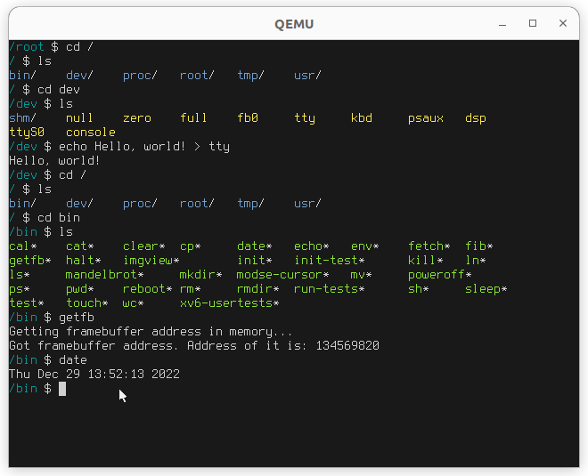

# Psychix
# Screenshot(s)

## What is Psychix?
Psychix is an open-source implementation of UNIX. It borrows code from Xv6, and Yagura. Psychix will be in heavy development to make it something useful and more powerful than other UNIX-like operating systems.
## How to build Psychix?
You'll need the following packages to be able to build Psychix:
* grub2
* gcc
* xorriso
* qemu (only for testing)
* cpio
Then, run the shell script `scripts/clean.sh` (run these scripts in the root directory of the project). This will clean everything for you. Then, run the command `export ARCH=i386`, which will tell the build script to build for the `i386` architecture (the x86_64 option is available, but is completely broken and being worked on). Then, run the `scripts/build.sh` shell script, which will build the kernel, the userspace binaries, and then make the initrd filesystem. After that, you can run the `scripts/run.sh` shell script (optionally) if you want to test Psychix. If you want to make a disk image (.iso) of Psychix, simply run the `scripts/cdrom.sh` shell script.
We're basically assuming that you're running an operating system that runs using the Linux kernel, or an operating system that works nearly like UNIX, aswell as on an architecture that is compatible with the i386 architecture...
# Plans & checklist
- [X] Unix sockets
- [X] Serial driver
- [ ] Psychix can build itself
- [X] Schelduler
- [X] Process system
- [X] Graphics
- [X] Device filesystem
- [X] Initrd, with good & organized filesystem
- [X] Libc
- [X] x86 support
- [ ] x86_64 support (Psychix works on x86_64, but doesn't reach 64-bit mode)
- [ ] ARM support
- [X] Basic command-line tools including `ls`, `mkdir`, `rm`, `rmdir`, `cat`, `grep`, etc
- [ ] Window system
- [ ] Lua ported
- [ ] Actual access to internet
- [ ] GCC ported
- [X] Dedicated developer
- [X] A good license
- [X] A good readme
- [ ] Exact documentation
# License
Although I could rewrite all of the code and change the license, I decided to stick with the license (MIT license), just because its a good and permissive license. See the license at LICENSE. If there are any ports, the license does not apply to them, rather the original software's license does.
