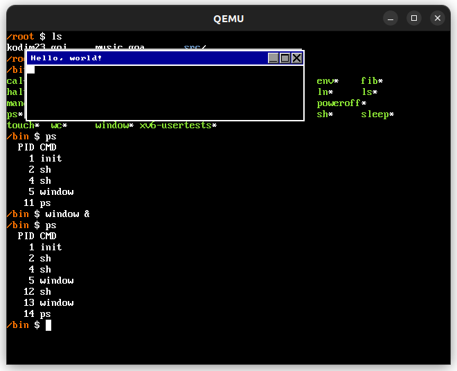

# Chaotix
[](https://github.com/Dashbloxx/chaotix/commits/main)
[](https://github.com/Dashbloxx/chaotix/graphs/contributors)
## Screenshot

## About
Chaotix (formerly known as Psychix or Magma) is a UNIX-like operating system written in C & multiple-architecture assembly that uses code from [Xv6](https://github.com/mit-pdos/xv6-public) and [Yagura](https://github.com/mosmeh/yagura). It's features range from multitasking, to graphics & more!
## Supported architectures
- [X] [`i?86`](https://en.wikipedia.org/wiki/X86)
- [ ] [`ARM`](https://en.wikipedia.org/wiki/ARM_architecture_family)
- [ ] [`RISC-V`](https://riscv.org/)
- [ ] [`PowerPC`](https://en.wikipedia.org/wiki/PowerPC)
- [ ] [`68K`](https://en.wikipedia.org/wiki/Motorola_68000_series)

64-bit ISAs will be supported later, but first we want to support the basic 32-bit architectures...
## Building
Building chaotix is easy. First of all, you'll need a `i686-elf` toolchain (if you don't have the toolchain, use chaotix's toolchain script which builds it for you). After that, simply run `make`. That builds the entire operating system (the kernel, libc, and the userland binaries).
If you change the configuration (Config.mk), you must run `make clean` to clean all built source code, and then build by running `make`.
## Testing & exporting
After building chaotix, you can test it and/or export it as a CD-ROM image. Chaotix supports using limine bootloader or GRUB bootloader. GRUB bootloader is the default option!
### Testing
To test chaotix, simply run:
```
make run
```
To that all of the features of chaotix work, simply run:
```
make test
```
### Exporting
To export chaotix, simply run:
```
make cdrom.iso
```
This will combine the chaotix kernel, it's initrd, and the GRUB bootloader into a bootable CD-ROM image (a `.iso` file). You can test it on real hardware by flashing that CD-ROM image to a USB drive using [balena etcher](https://www.balena.io/etcher) or [rufus](https://rufus.ie/en/).
Chaotix supports multiboot, so you can also combine chaotix's kernel & initrd with any other bootloader that supports multiboot, but that isn't to be documented right now.
## License

<a href="https://opensource.org/licenses/MIT"></a>

The Chaotix operating system is licensed under the **MIT License**.

See [LICENSE](LICENSE) to view the license. Also, take note that all files contain the license & copyright notice, unless if they are licensed under a license different from the MIT license. All fonts inside `base/usr/share/fonts` are **NOT** subject to Chaotix's copyright, and they are under a different license.
